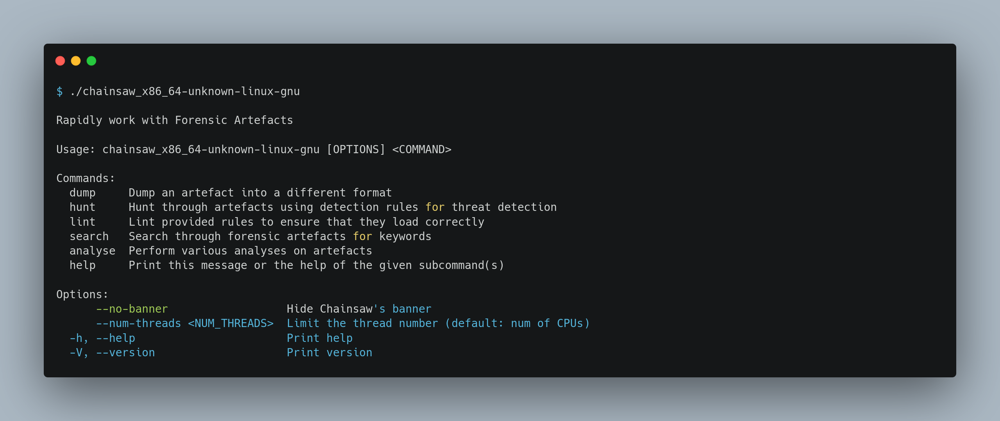
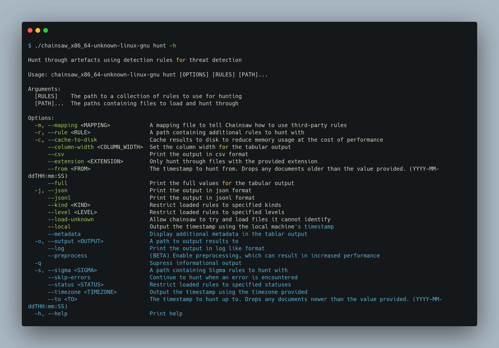
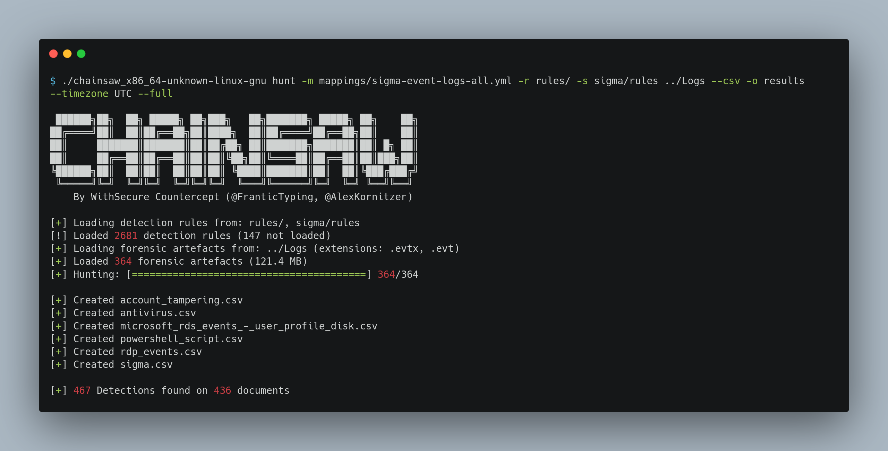
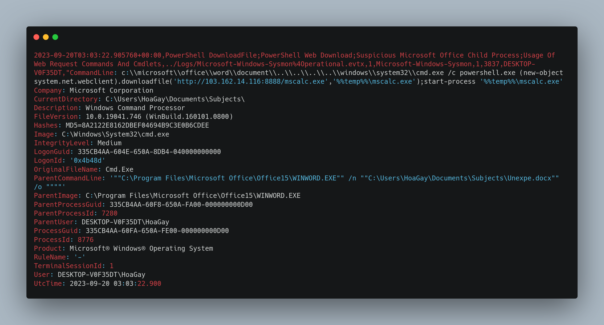
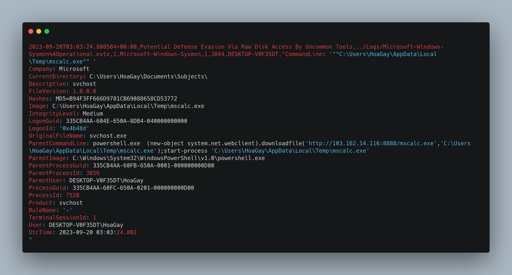
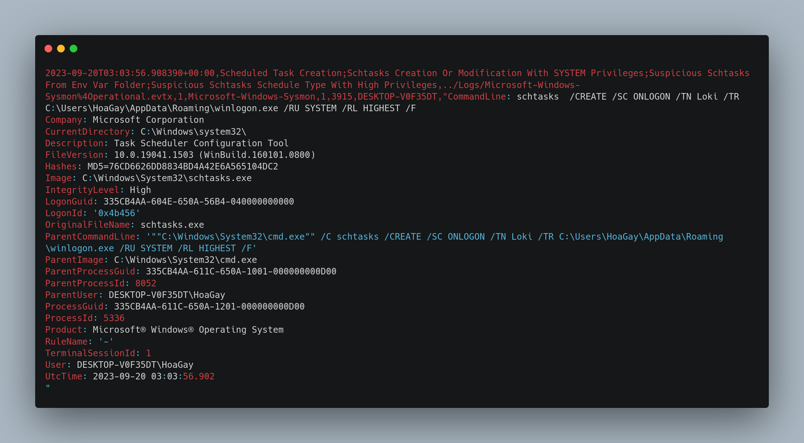

 <font size='10'>Valhalloween</font>

20<sup>th</sup> October 2023 / Document No. D23.102.XX

Prepared By: Bquanman, thewildspirit

Challenge Author(s): Bquanman

Difficulty: <font color=orange>Medium</font>

Classification: Official

# Synopsis

Valhalloween is a medium forensics challenge that involves analyzing events and sysmon logs generated by the execution of the Loki ransomware.

## Description

* As I was walking the neighbor's streets for some Trick-or-Treat, a strange man approached me, saying he was dressed as "The God of Mischief!". He handed me some candy and disappeared. Among the candy bars was a USB in disguise, and when I plugged it into my computer, all my files were corrupted! First, spawn the haunted Docker instance and connect to it! Dig through the horrors that lie in the given Logs and answer whatever questions are asked of you!

## Skills Required

* Familiarity with event logs
* Familiarity with sysmon logs
* Ransomware behavior knowledge

## Skills Learned

* Identifying and detecting a real ransomware
* Categorizing malware into families based on public information
* Detecting persistence mechanisms from Windows logs.
* Tracing an infection chain back to its root.

# Enumeration
Players are given the following folder:
* **Logs**: `Contains all the compromised machine event (and Sysmon) logs`.

As mentioned in the description, we need to answer the following questions regarding the given logs to get the flag.
```py
[1]. What are the IP address and port of the server from which the malicious actors downloaded the ransomware? (for example: 98.76.54.32:443)

[2]. According to the sysmon logs, what is the MD5 hash of the ransomware? (for example: 6ab0e507bcc2fad463959aa8be2d782f)

[3]. Based on the hash found, determine the family label of the ransomware in the wild from online reports such as Virus Total, Hybrid Analysis, etc. (for example: wannacry)  

[4]. What is the name of the task scheduled by the ransomware? (for example: WindowsUpdater)  

[5]. What are the parent process name and ID of the ransomware process? (for example: svchost.exe_4953) 

[6]. Following the PPID, provide the file path of the initial stage in the infection chain. (for example: D:\Data\KCorp\FirstStage.pdf) 
 
[7]. When was the first file in the infection chain opened (in UTC)? (for example: 1975-04-30_12:34:56) 
```
We will use the default Windows Event Viewer and [chainsaw](https://github.com/WithSecureLabs/chainsaw) for this writeup, although we can use multiple event log analysis tools.

### How to use Chainsaw

After we either download the release [file](https://github.com/WithSecureLabs/chainsaw/releases/download/v2.8.0/chainsaw_all_platforms+rules.zip) or build it ourselves, we need to decide which options we are going to use.



Hunt through artifacts using detection rules for threat detection sounds like the ideal option for our case since we are provided with logs. Let us see what are our `hunt` options.



* `--mapping`: We need Chainsaw to know how to use our rules.
* `--rule`: To provide our rules.
* `--sigma`: To provide our sigma rules.
* `--csv`: Print the output in csv format.
* `--timezone`: We need timestamps in the UTC timezone.
* `--output`: To specify an output folder.
* `--full`: To print full values for the tabular output

And at last, we can parse the logs.



# Solution
Now, we are ready to start answering the questions.

### Question 1 
We can easily find the following rule when searching the `sigma.csv` file from rules containing the `Download` keyword.



Or we can open the PowerShell logs and notice the following entry immediately.


From this output, we know that:

* The attacker downloaded a file called `mscalc.exe`.
* From the IP:PORT `103.162.14.116:8888`.
* Saved it to the `%%temp%%` folder.
* And executed the file.

Our answer to this question is:

=> `103.162.14.116:8888`

### Question 2

We will now move on to analyzing Sysmon logs. Log sysmon is configured to save hashes of executable files, so to search for the MD5 of a ransomware file, we must look for the event in which it was executed.

The above PowerShell command downloads and executes the ransomware file with **start-process**, so the ransomware process (mscalc.exe) will be a child process of powershell.exe. Search for event Process Create (ID 1) whose parent process is the PowerShell command above.


Or, using the `sigma.csv` file, we can search for events that occurred from a command line that contains `mscalc.exe`.



Our answer to this question is:
=> md5: `B94F3FF666D9781CB69088658CD53772`

### Question 3
Files analyzed by Virustotal will often be assigned a family label corresponding to their characteristics. For example: wannacry.


Of course, it's not always true, but we may also need to search for information on Google. Based on the hash above, search for information about ransomware on Virustotal. Fortunately, it is not new malware, and there is already information about it on Virustotal.


Our answer to this question is:
=> `lokilocker`

### Question 4

Information about Task Scheduled is located in Microsoft-Windows-TaskScheduler/Operational with ID 106.


Or you can find the task scheduler process as a child process of mscalc.exe


Or we can search for a Scheduled task entry in the `sigma.csv` file.



Our answer to this question is:
=> `Loki`

### Question 5 
As we noticed in the second entry for question number 2, the parent process ID is: `3856`


And since `mscalc.exe` was executed by PowerShell, as it can be seen from the `CommandLine` attribute, it is safe to assume that the parent process name is `powershell.exe`

Our answer to this question is:
=> `powershell.exe_3856`

### Question 6
To find the first file in the infection chain, you need to find the root process that spawned the ransomware, which can be done by searching by ParentProcessId. An incomplete process tree can be visualized as follows:

mscalc.exe-7528 <= powershell.exe-3856 <= cmd.exe-8776 <= WINWORD.EXE-7280 with file Unexpe.docx


Also, there are a few files that cause interference.


It can also be found from the entry we detected for the first question.

Our answer to this question is:
=> `C:\Users\HoaGay\Documents\Subjects\Unexpe.docx`

### Question 7
filter id 1 (process create) with process id 7280, you will see the time the file was opened


Our answer to this question is:
=> 2023-09-20_03:03:20
