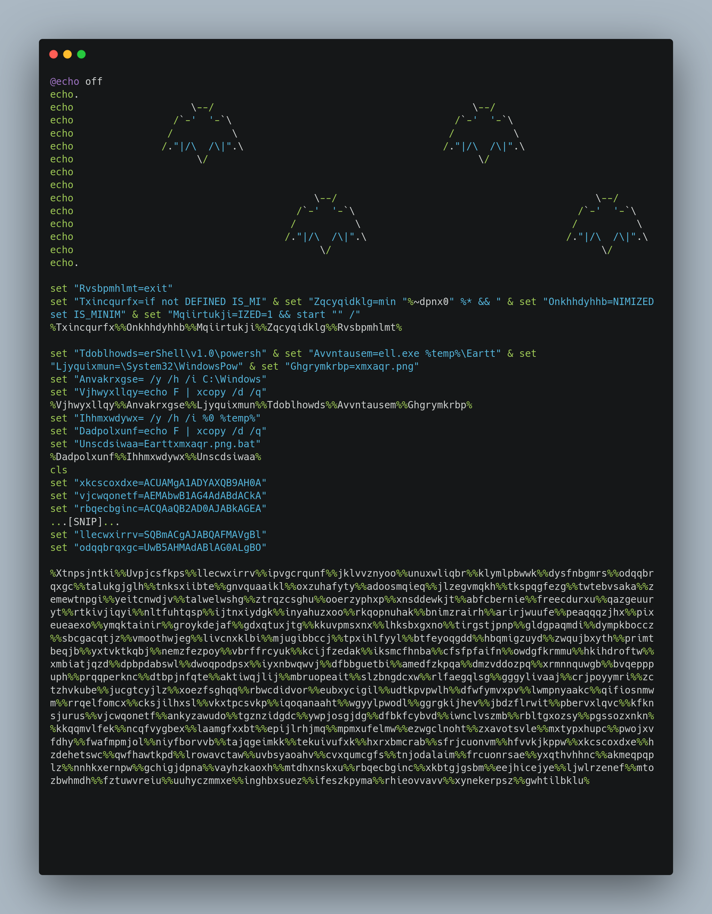
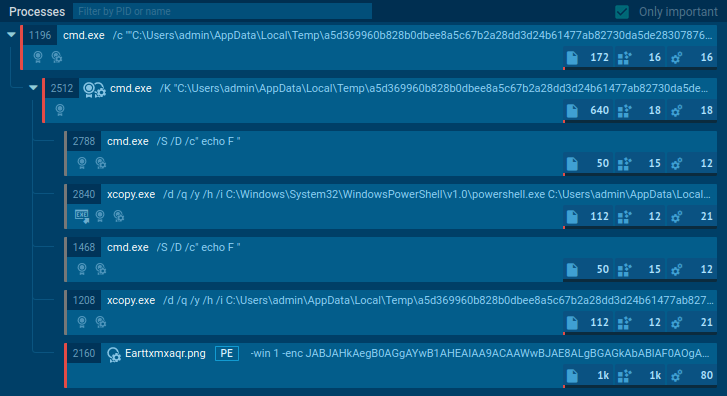
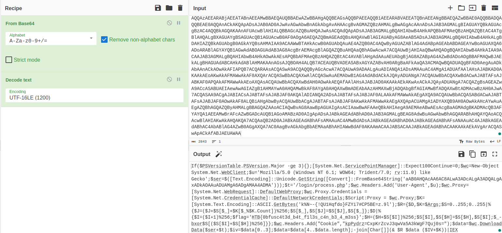

 Bat Problems

11th September 2023 / Document No. D22.102.XX

Prepared By: thewildspirit

Challenge Author(s): thewildspirit

Difficulty: Very Easy

Classification: Official

# Synopsis

This is a very easy and straightforward forensic challenge. It features an obfuscated `bat` script that on execution, uses PowerShell to establish an Empire beacon connection.

## Description

* On a chilly Halloween night, the town of Hollowville was shrouded in a veil of mystery. The infamous "Haunted Hollow House", known for its supernatural tales, concealed a cryptic document. Whispers in the town suggested that the one who could solve its riddle would reveal a beacon of hope. As an investigator, your mission is to decipher the script's enigmatic sorcery, break the curse, and unveil the flag to become Hollowville's savior.

## Skills Required

* Basic programming principles

## Skills Learned

* Base64 decoding
* PowerShell usage

# Enumeration

We are given the following file:
* `payload.bat`: Malicious bat file.

As we can see from the following image, the bat script contains many random variables that are assigned random values. Let us explain what are these `set` commands. In a batch script (a .bat or .cmd file), the set command defines and manipulates environment variables. Environment variables store information that can be used by the script or other programs running in the same environment (the Command Prompt session).

Later, users can call or retrieve its value using `%variableName%`. Although an experienced player may be able to identify that the strings are base64, let us proceed without knowing it. 

There are multiple ways to solve this challenge. This script sets the variables in a random order, and at last, it calls them in the correct order. So we either do it manually and concat the string ourselves (this can be achieved by either doing it completely manually or creating a script to do it), or we can use [any.run](https://any.run/) or any other dynamic analysis tool.

# Solution

For this writeup, we will use `any.run` since, although it is time-consuming, writing a script to solve this challenge is doable. The `any.run` option will help players learn how to analyze malware using a dynamic analysis approach.
We will get the following result if we upload the sample on the aforementioned site.

Let's analyze the important processes here.

1. `xcopy /d /q /y /h /i C:\Windows\System32\WindowsPowerShell\v1.0\powershell.exe C:\Users\admin\AppData\Local\Temp\Earttxmxaqr.png`: Using `cmd` the attacker copies PowerShell to a different path with a random name. This is called `PS renaming attack` and, by most Anti-Virus services, can be considered a stealthy technique.
2. `xcopy /d /q /y /h /i C:\Users\admin\AppData\Local\Temp\a5d369960b828b0dbee8a5c67b2a28dd3d24b61477ab82730da5de2830787678.bat C:\Users\admin\AppData\Local\Temp\Earttxmxaqr.png.bat`: Again using cmd the attacker can rename the downloaded bat file and also change it's extension to `.png.bat` to avoid detection. 
3. `C:\Users\admin\AppData\Local\Temp\Earttxmxaqr.png  -win 1 -enc JABJAHkAeg[...SNIP...]`: At last, the attacker, using the renamed PowerShell executable, executes the base64 encoded string. We know that because `-enc` PowerShell's argument is used to pass a base64 encoded command.

By decoding the string in [cyberchef](https://gchq.github.io/CyberChef/) we can get the flag.

