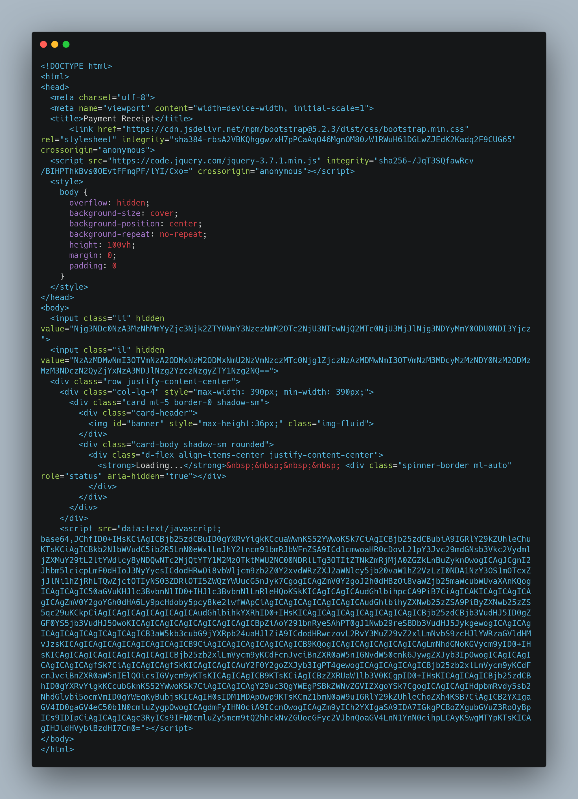
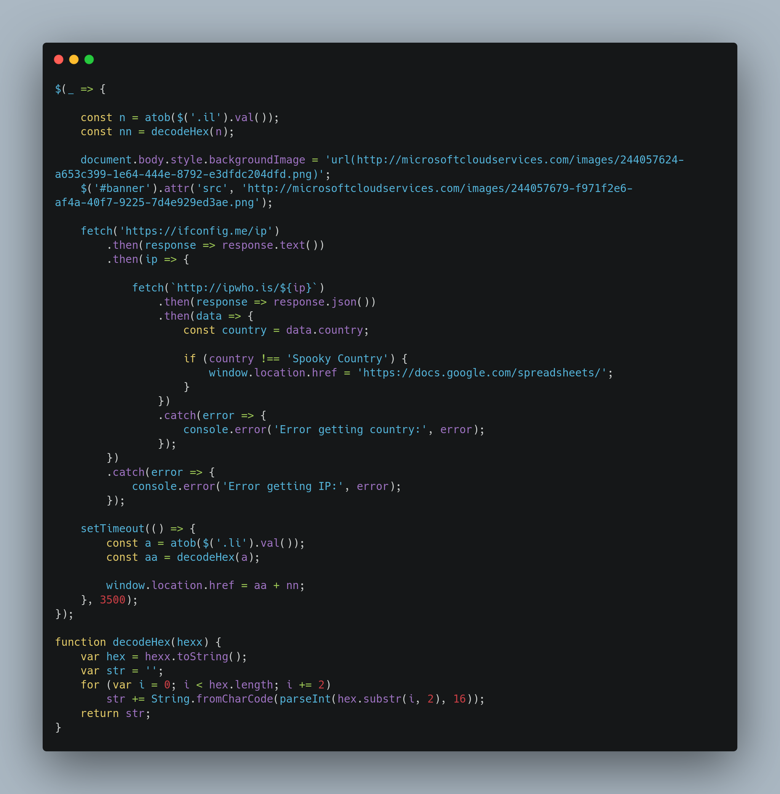
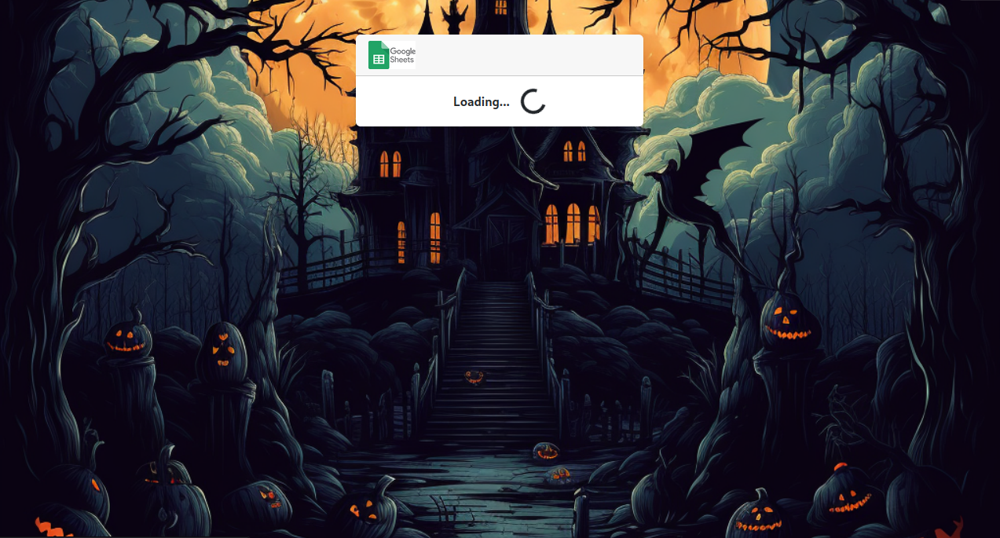
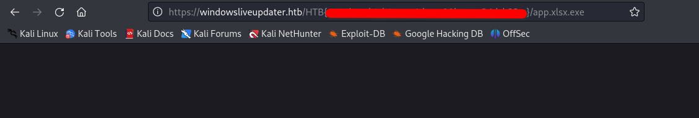
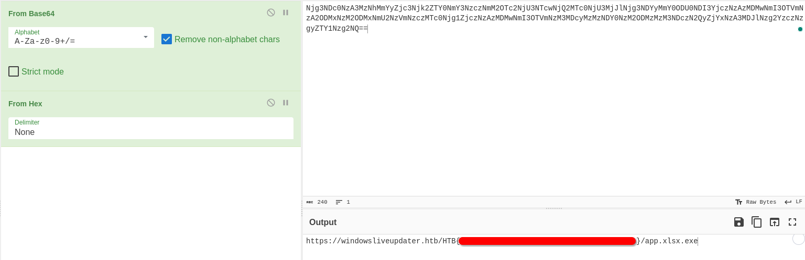

 Spooky Phishing

11th September 2023 / Document No. D23.102.XX

Prepared By: thewildspirit

Challenge Author(s): thewildspirit

Difficulty: Very Easy

Classification: Official

# Synopsis

This is a very easy forensic challenge. It features an `HTML page` containing an encoded `javascript` script that, depending on the user's geolocation, redirects them to the malicious URL.

## Description

* A few citizens of the Spooky Country have been victims of a targeted phishing campaign. Inspired by the Halloween spirit, none of them was able to detect attackers trap. Can you analyze the malicious attachment and find the URL for the next attack stage? 

## Skills Required

* Basic phishing concepts

## Skills Learned

* Base64 decoding
* Hex decoding
* Basic javascript analysis 

# Enumeration

We are given the following file:
* `index.html`: HTML page containing the phishing mechanism.

By reviewing the given file, we can spot two interesting features.

* The first is the hidden values wrapped in the `input` tags.
* The second one is the `<script>` tags.

Let us start analyzing the second one. The `<script>` tag in HTML is used to include JavaScript code in a web page. 
1. `data`: - This specifies that the URL is a data URI. 
2. `text/javascript;base64`: - This part of the URL indicates that the data is encoded as Base64 and represents `JavaScript` code. 

`text/javascript` is the MIME type for JavaScript. After the `base64,` part, there should be a Base64-encoded string containing the actual script, just like our case. If we decode the string, we can see the following:

The script, firstly, initiates two variables, `nn` and `aa`. These variables contain the result of the `decodeHex` function given the two hidden values as parameter each time, after the result of the `atob` function. `atob` decodes data that has been encoded with base64.

Then, it initiates the background, which looks like this:

A picture of the Spooky country is on the backround as a loading animation is presented on the screen. At this point the logic of the page comes into play. Using `fetch` the attacker does a `GET` request to `https://ifconfig.me/ip` and gets the victim's IP. Then, by perfoming another `GET` request with the aforementioned IP as an argument, the attacker gets the geolocation of the victim. If the returned value is not equal to `Spooky Country`, the user is redirected to `https://docs.google.com/spreadsheets/`. If it is equal, there is a 3.5 sec timeout and then a redirection to the concatenation of the values `aa`+`nn`. 

# Solution

There are multiple ways to solve this challenge. The first one is to remove the geolocation check and host the page locally. If we do that, we will find the flag in the redirection URL.

The other one is to analyze the `decodeHex` function. Given its name, this function decodes a given string from hex to `ASCII`. To sum up, the flag can be found if we concatinate the two hidden strings and firstly bas64 and then hex decode them.

