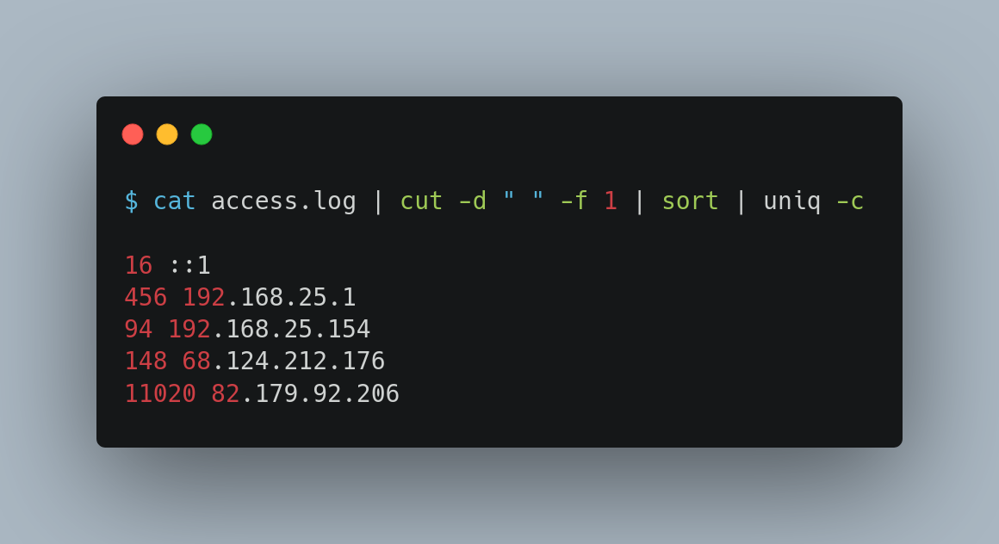
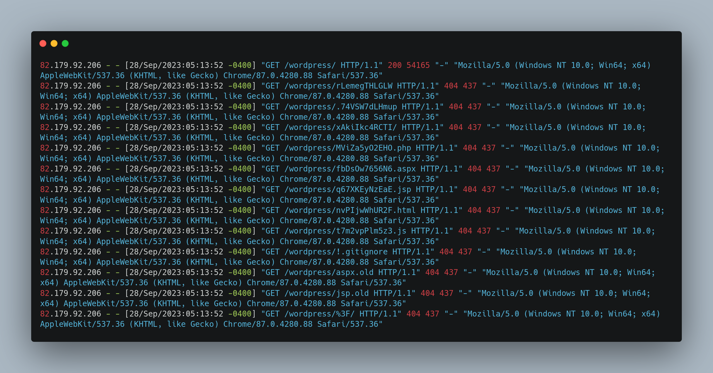
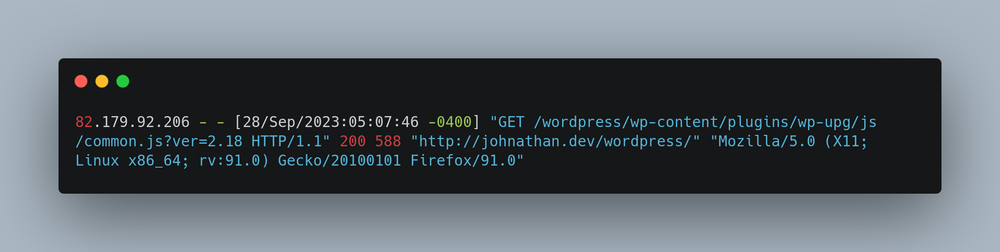
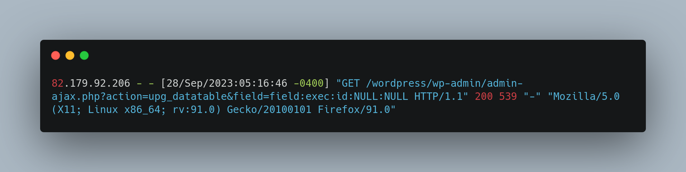
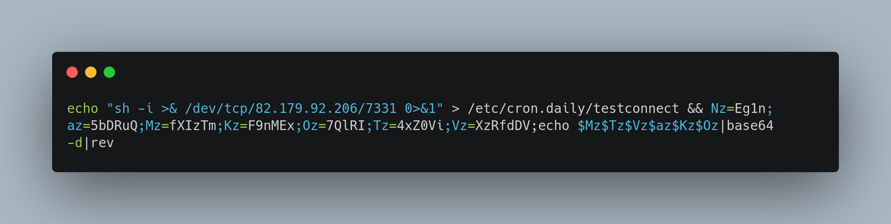
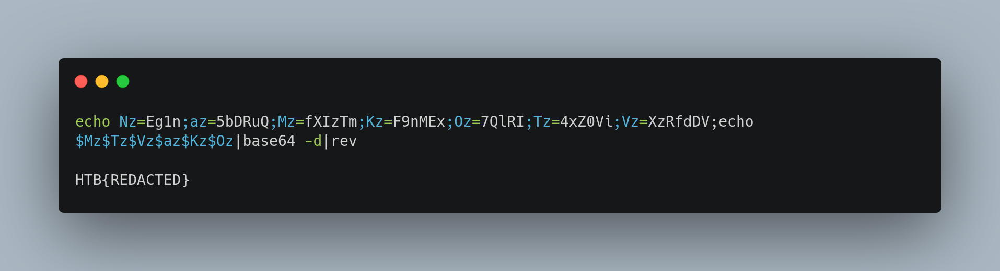

 Vulnerable Season

11th September 2023 / Document No. D23.102.XX

Prepared By: N00b, thewildspirit

Challenge Author(s): N00b

Difficulty: Very Easy

Classification: Official

# Synopsis

Vulnerable Season is a very easy forensics challenge focused on web-server log analysis.

## Description

* Halloween season is a very busy season for all of us. Especially for web page administrators. Too many Halloween-themed parties to attend, too many plugins to manage. Unfortunately, our admin didn't update the plugins used by our WordPress site and as a result, we got pwned. Can you help us investigate the incident by analyzing the web server logs?

## Skills Required

* Basic computer science knowledge

## Skills Learned

* Base64 decoding
* URL decoding
* Log analysis

# Enumeration

We are given the following file:
* `access.log`: Server logs.

### Step 1: Analyzing the Log

When investigating a security breach, the first step is to gather as much information as possible. Analyzing log files is a crucial part of this process because logs can provide valuable insights into the attacker's activities. We can quickly pinpoint potential suspects by identifying the IP addresses involved and sorting them by the number of requests. This step helps us narrow down the focus and prioritize further analysis.

In the `access.log` file, you'll notice several requests related to the `johnathan.dev/wordpress` website.

The output shows a list of IP addresses and the number of requests from each IP. One IP stands out: `82.179.92.206`. It has the most requests, indicating a potentially suspicious activity.

### Step 2: Identifying the Vulnerability

Once a potential attacker's IP address is identified, we must understand how the breach occurred. Upon closer examination of the requests from the IP address `82.179.92.206`, we notice that many are related to scanning the web page.

One request reveals that the WordPress site uses the `wp-upg` plugin version 2.18, which has a known vulnerability, `CVE-2022-4060`. 
In this case, it was discovered that the attacker targeted a specific vulnerability in a WordPress plugin. Understanding the vulnerability allows us to comprehend the attack vector.

For this challenge, this step is optional. Players don't need to know the CVE of the vulnerability to solve the challenge.

### Step 3: Examining Exploitation Attempts

In-depth analysis of log entries related to the attacker's IP address is essential. We must pay attention to requests with response status codes, as these can reveal whether the attacker's attempts were successful. 
We continue to analyze the log, focusing on requests from the IP `82.179.92.206` with a response status code of `200`. These requests confirm that the attacker is exploiting the `wp-upg` plugin.

For example:

These requests indicate the attacker is attempting to execute arbitrary commands on the system.

# Solution

### Step 4: Decoding and Uncovering the Flag

After identifying the attacker's activities and understanding the breach, we should work on deciphering any encoded or obfuscated information, as attackers often attempt to hide their tracks.

One of the requests creates a cron job named `testconnect` that connects to a Command and Control (CnC) server and prints the flag.

To decode the URL and reveal the flag:

This command sets up the `testconnect` cron job, connecting to the CnC server and printing the flag.

The result:

We successfully uncovered the flag.
