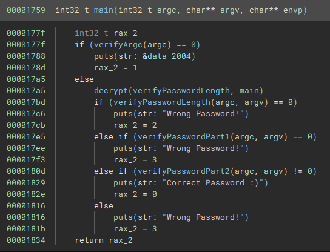
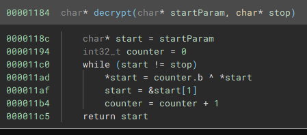
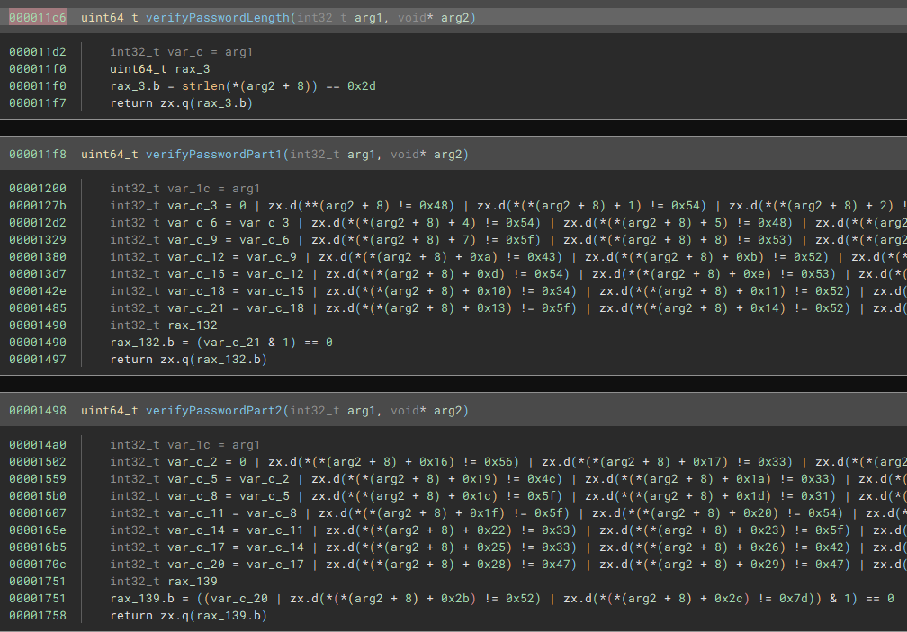

 
<font size='6'>Dynamic Secrets</font>

28<sup>th</sup> 2022 / Document No. D22.102.16

Prepared By: `clubby789`

Challenge Author(s): `clubby789`

Difficulty: <font color=green>Very Easy</font>

Classification: Official

# Synopsis

- The task is to hex-decode the first part of the flag and base64-decode the second part.

## Description
* When I put this file in Ghidra the flag comparison looks like gibberish, maybe it is doing something at runtime?

## Skills Required

* Basic understanding of XOR
* Basic understanding of dynamic analysis

### Skills Learned
* Performing runtime decryption

# Analysis



The binary wants one argument, then decrypts part of the program which is responsible for checking the length and the flag in two parts.



The decryption routine XORs the bytes with the index % 256 starting at the address of `verifyPasswordLength` (relative `0x11c6`) up to relative address `0x1759`.

We can either dynamically follow the program to see how it looks after decryption or we can decrypt the binary our self and take a look:

```python
f = open("challenge", "rb")
data = list(f.read())
f.close()

start = 0x11c6
end = 0x1759

i = 0
while start != end:
    data[start] = data[start] ^ (i&0xff)
    start += 1
    i+=1

f = open("challenge", "wb")
f.write(bytes(data))
f.close()
```

Which then shows the length and individual character comparisons:




Extracting the compared characters gives the flag:

```
$ ./dynamic_secrets HTB{f4k3_fl4g_f0r_wr1t3up}
Correct Password :)
```