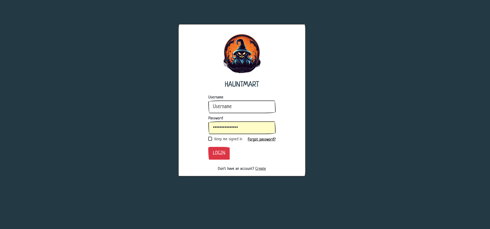
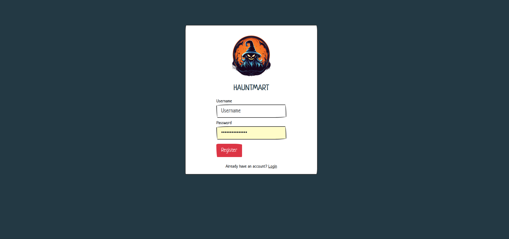
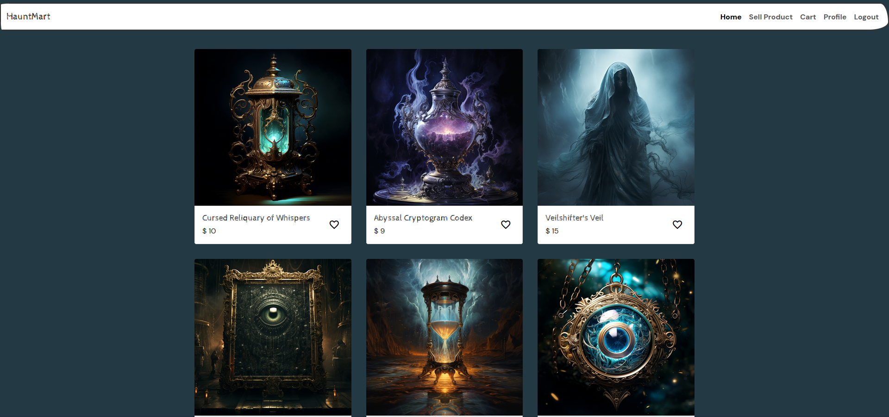
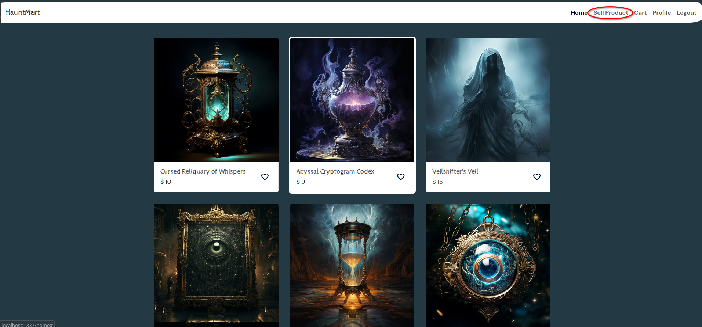
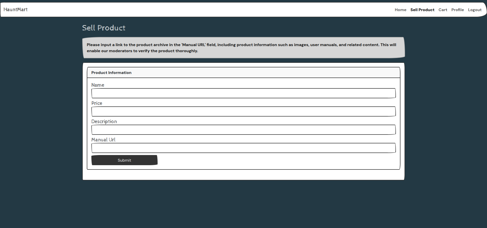
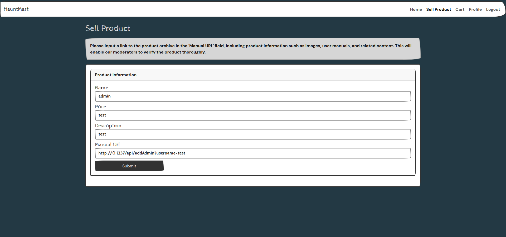
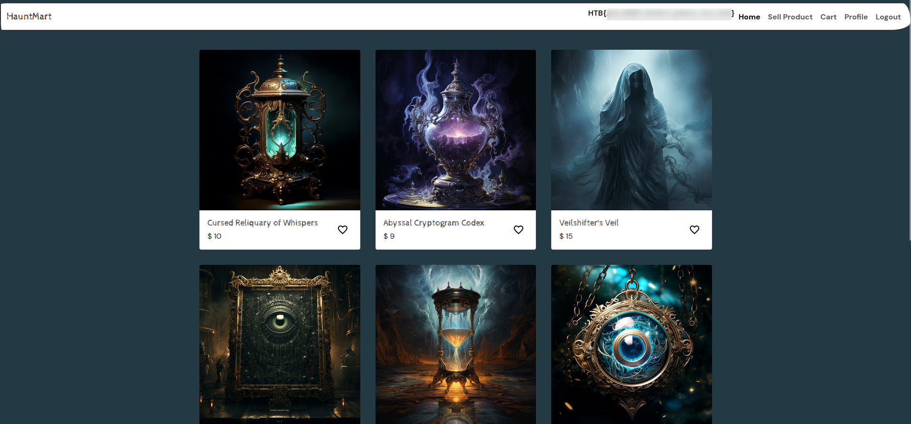

<font size="5px">HauntMart</font>

​      25<sup>th</sup> October 2023 / Document No. D23.XX.XX

​      Prepared By: lean

​      Challenge Author(s): xclow3n

​      Difficulty: <font color=green>Easy</font>

​      Classification: Official

<br>
<br>
<br>
<br>

# [Synopsis](#synopsis)

* SSRF filter bypass

## Description

HauntMart, a beloved Halloween webstore, has fallen victim to a curse, bringing its products to life. You must explore its ghostly webpages, and break the enchantment before Halloween night. Can you save Spooky Surprises from its supernatural woes?.

## Skills Required

* Basic understanding of HTTP.

* Basic understanding of Flask and Python.


## Skills Learned

* Performing SSRF filter bypass.

# [Solution](#solution)

## Application Overview

On the homepage we can see a login page to the hauntmart.



We can click on "Create" to go to `/register`. From here we can create an account and log-in.



After we log-in we can see the products listed on the store.



There is an option on the navigation bar called "sell product".



Clicking on it will redirect us to `/product`.



Here we can list our own product by providing some information about it and the "manual url". This feature is handled at `./challenge/application/blueprint/routes.py`.

The `@isAuthenticated` middleware is used at first, the endpoint expects a json body with some speciffic keys inside, the the `downloadManual` function is called with the `manualUrl` value from the json body as a parameter. If this call returns `False` the request is terminated with status `400`, otherwise the `addProduct` function is called with `name`, `description` and `price` as parameters and the request is terminated succesfully.

```py
@api.route('/product', methods=['POST'])
@isAuthenticated
def sellProduct(user):
    if not request.is_json:
        return response('Invalid JSON!'), 400

    data = request.get_json()
    name = data.get('name', '')
    price = data.get('price', '')
    description = data.get('description', '')
    manualUrl = data.get('manual', '')

    if not name or not price or not description or not manualUrl:
        return response('All fields are required!'), 401

    manualPath = downloadManual(manualUrl)
    if (manualPath):
        addProduct(name, description, price)
        return response('Product submitted! Our mods will review your request')
    return response('Invalid Manual URL!'), 400
```

The `@isAuthenticated` middleware check if a flask session with key `token` is set and returns the JWT-decoded values if it is a valid one.

```py
def isAuthenticated(f):
    @wraps(f)
    def decorator(*args, **kwargs):
        token = session.get("token")

        if not token:
            return abort(401, "Unauthorised access detected!")

        user = tokenVerify(token)

        kwargs["user"] = user

        return f(*args, **kwargs)

    return decorator
```

The `downloadManual` function takes a "url" string as a parameter and checks if the provided url contains a blocked host using the `isSafeUrl` function.

```py
blocked_host = ["127.0.0.1", "localhost", "0.0.0.0"]

def isSafeUrl(url):
    for hosts in blocked_host:
        if hosts in url:
            return False
    
    return True
```

If "url" does contain a blocked host the function returns `False`, otherwise it makes a request to the speciffied url and saves some metadata that is expected from the response.

```py
def downloadManual(url):
    safeUrl = isSafeUrl(url)
    if safeUrl:
        try:
            local_filename = url.split("/")[-1]
            r = requests.get(url)
            
            with open(f"/opt/manualFiles/{local_filename}", "wb") as f:
                for chunk in r.iter_content(chunk_size=1024):
                    if chunk:
                        f.write(chunk)
            return True
        except:
            return False
    
    return False
```

Another interesting endpoint to us would be `/home`, that also uses the `@isAuthenticated` middleware and renders the flag contents if reached successfully.

```py
@web.route('/home', methods=['GET'])
@isAuthenticated
def homeView(user):
    return render_template('index.html', user=user, flag=current_app.config['FLAG'])
```

But by having a closer look at the template it renders we see that the flag is shown only if our user role is "admin".

```html
<div class="container-fluid">
    <a class="navbar-brand" href="#">HauntMart</a>
    <button class="navbar-toggler" type="button" data-bs-toggle="collapse" data-bs-target="#navbarColor03"
        aria-controls="navbarColor03" aria-expanded="false" aria-label="Toggle navigation">
        <span class="navbar-toggler-icon"></span>
    </button>
    <div class="collapse navbar-collapse" id="navbarColor03">
        <ul class="navbar-nav ms-auto">
            
                {{flag}}
            
            <li class="nav-item">
                <a class="nav-link active" href="/home">Home
                </a>
            </li>
            <li class="nav-item">
                <a class="nav-link" href="/product">Sell Product</a>
            </li>
            <li class="nav-item">
                <a class="nav-link" href="#">Cart</a>
            </li>
            <li class="nav-item">
                <a class="nav-link" href="#">Profile</a>
            </li>
            <li class="nav-item">
                <a class="nav-link" href="/logout">Logout</a>
            </li>
        </ul>
    </div>
</div>
```

Conveniently enough there is a function that would allow us to elevate our priviledges if called, it is defined at `./challenge/application/database.py`.

```py
def makeUserAdmin(username):
    check_user = query('SELECT username FROM users WHERE username = %s', (username,), one=True)
    
    if check_user:
        query('UPDATE users SET role="admin" WHERE username=%s', (username,))
        mysql.connection.commit()
        return True

    return False
```

The only place where this function is called is at the `/addAdmin` endpoint which is also protected from the `@isFromLocalhost` middleware.

If this endpoint is reached thet user with the provided username will be turned to an admin. Thus being able to access `/home` and render the flag.

```py
@api.route('/addAdmin', methods=['GET'])
@isFromLocalhost
def addAdmin():
    username = request.args.get('username')
    
    if not username:
        return response('Invalid username'), 400
    
    result = makeUserAdmin(username)

    if result:
        return response('User updated!')
    return response('Invalid username'), 400
```

But it is only reachable from localhost due to the implemented middleware.

```py
def isFromLocalhost(func):
    @wraps(func)
    def check_ip(*args, **kwargs):
        if request.remote_addr != "127.0.0.1":
            return abort(403)
        return func(*args, **kwargs)

    return check_ip
```

## Getting SSRF

There is a way to bypass the localhost check, by using an address that would resolve to "localhost" and is not included in the `blocked_host` list.

By selling a product with the following "manual url" we are able to reach the `/addAdmin` endpoint and make ourselves an admin in order to reach the flag.

```
http://0:1337/api/addAdmin?username=test
```



Now logging out and back in again will make the flag appear in the navigation bar.

