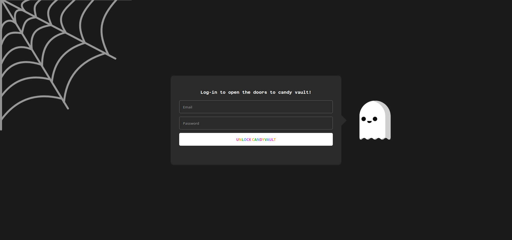
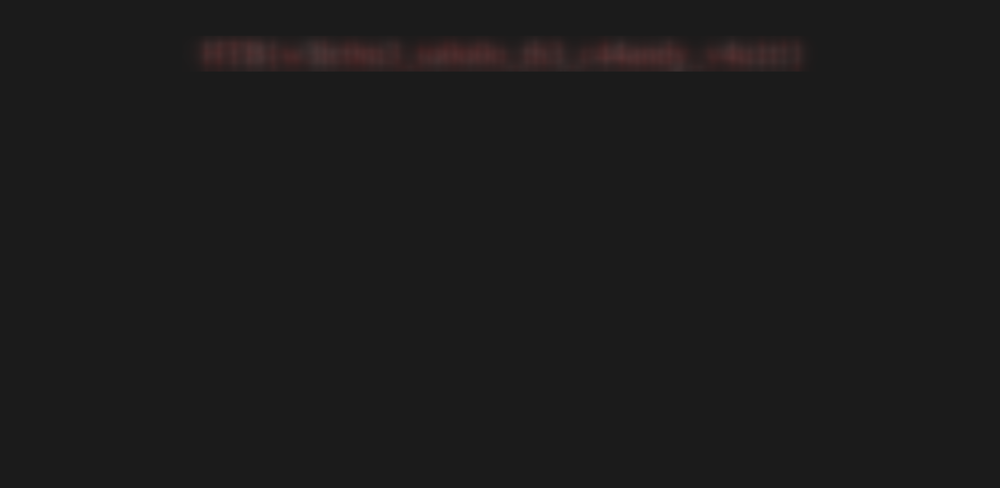

<font size="5px">CandyVault</font>

​      12<sup>th</sup> October 2023 / Document No. D23.XX.XX

​      Prepared By: lean

​      Challenge Author(s): lean

​      Difficulty: <font color=green>Very Easy</font>

​      Classification: Official

<br>
<br>
<br>
<br>

# [Synopsis](#synopsis)

* MongoDB noSQL authentication bypass.

## Description

The malevolent spirits have concealed all the Halloween treats within their secret vault, and it's imperative that you decipher its enigmatic seal to reclaim the candy before the spooky night arrives.

## Skills Required

* HTTP requests interception via proxy tools, e.g., Burp Suite / OWASP ZAP.

* Basic understanding of Flask and Python.

* Basic understanding of MongoDB or noSQL databases.


## Skills Learned

* Performing authentication bypass on noSQL databases.

# [Solution](#solution)

## Application Overview

On the homepage we can see a login page to the candy-vault.



By examining the file `./challenge/application/app.py` file we can see that there is a MongoClient instance set-up and some routes registered.

```py
from flask import Flask, Blueprint, render_template, redirect, jsonify, request
from flask_bcrypt import Bcrypt
from pymongo import MongoClient

app = Flask(__name__)
app.config.from_object("application.config.Config")
bcrypt = Bcrypt(app)

client = MongoClient(app.config["MONGO_URI"])
db = client[app.config["DB_NAME"]]
users_collection = db["users"]

@app.errorhandler(Exception)
def handle_error(error):
    message = error.description if hasattr(error, "description") else [str(x) for x in error.args]
    
    response = {
        "error": {
            "type": error.__class__.__name__,
            "message": message
        }
    }

    return response, error.code if hasattr(error, "code") else 500


@app.route("/", methods=["GET"])
def index():
    return render_template("index.html")


@app.route("/login", methods=["POST"])
def login():
    content_type = request.headers.get("Content-Type")

    if content_type == "application/x-www-form-urlencoded":
        email = request.form.get("email")
        password = request.form.get("password")

    elif content_type == "application/json":
        data = request.get_json()
        email = data.get("email")
        password = data.get("password")
    
    else:
        return jsonify({"error": "Unsupported Content-Type"}), 400

    user = users_collection.find_one({"email": email, "password": password})

    if user:
        return render_template("candy.html", flag=open("flag.txt").read())
    else:
        return redirect("/")

```

The `/` route simply renders the login page.

```py
@app.route("/", methods=["GET"])
def index():
    return render_template("index.html")
```

The `/login` route is responsible for handling the authentication, if the user is authenticated successfully the page `candy.html` is rendered alongside a variable that contains the **flag** that is read from the `flag.txt` file. Otherwise the user gets redirected to the to `/` which renders the login page once more.

```py
@app.route("/login", methods=["POST"])
def login():
    content_type = request.headers.get("Content-Type")

    if content_type == "application/x-www-form-urlencoded":
        email = request.form.get("email")
        password = request.form.get("password")

    elif content_type == "application/json":
        data = request.get_json()
        email = data.get("email")
        password = data.get("password")
    
    else:
        return jsonify({"error": "Unsupported Content-Type"}), 400

    user = users_collection.find_one({"email": email, "password": password})

    if user:
        return render_template("candy.html", flag=open("flag.txt").read())
    else:
        return redirect("/")
```

If we take a closer look we can see that this endpoint expects the `Content-Type` header to be set in the request.

If it is equal to `application/x-www-form-urlencoded` it reads **email** and **password** inputs as forms and if it is equal to `application/json` it expects them from a json object.

After the content type check, the mongodb `.find_one` method is called on the `users_collection` with **{"email": email, "password": password}** as the parameter. This queries MongoDB for a user that matches the provided email and password.

If a match is found the `candy.html` page that contains the flag is rendered, so this is the logic that must be bypassed.

## NoSQL exploitation

Since we can control whether the **email** and **password** are read from a json object, this means that we are not limited to inserting on strings as input.

A typical MongoDB login bypass can be used here with the payload looking like this:

```json
{
    "email": {
        "$ne": 0
    }, 
    "password": {
        "$ne": 0
    } 
}
```

A payload like this will force MongoDB to fetch a user where **email** is not equal to **0** and **password** is not equal to **0**, in our case this would be the first user, and since a valid user is returned we get authenticated and retrieve the flag!


