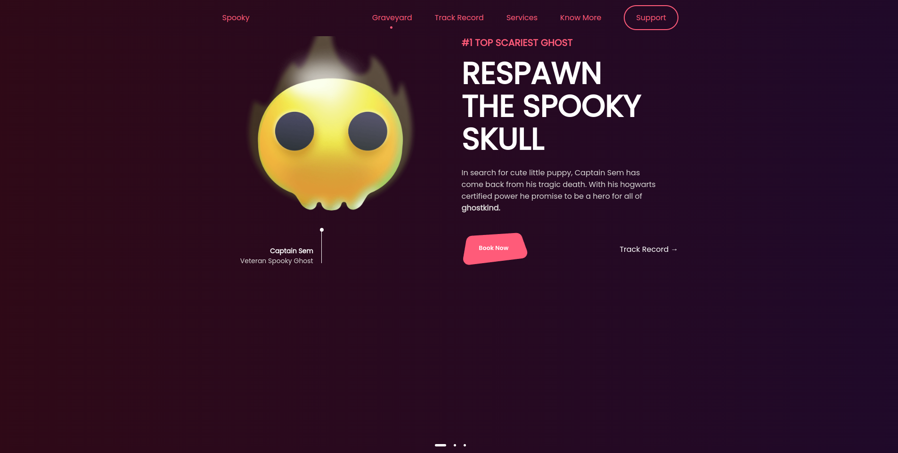
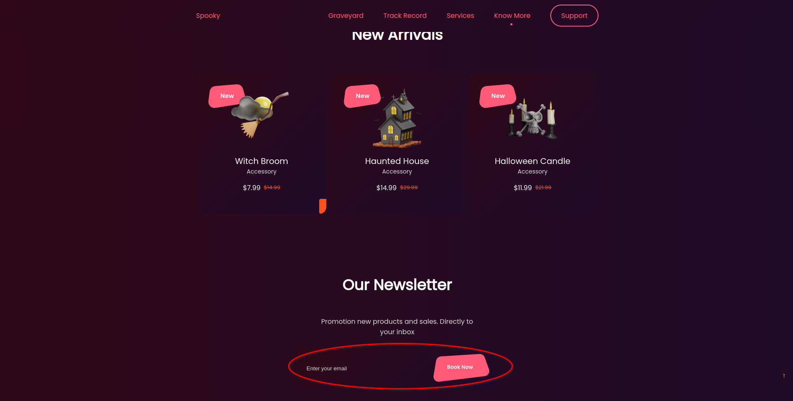
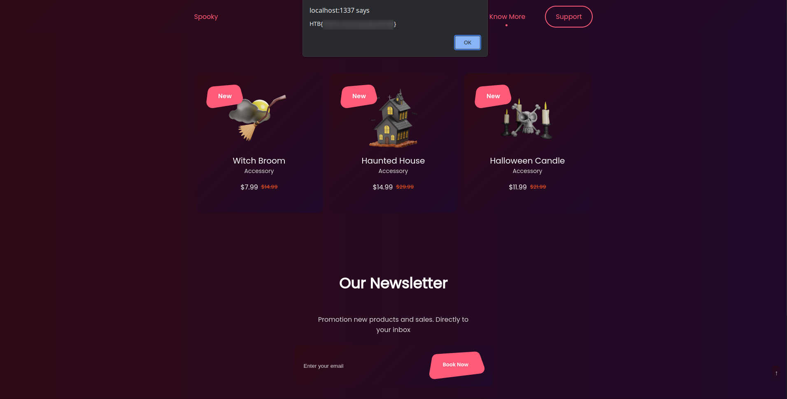

<font size="5px">SpookTastic</font>

​      12<sup>th</sup> October 2023 / Document No. D23.XX.XX

​      Prepared By: lean

​      Challenge Author(s): lean

​      Difficulty: <font color=green>Very Easy</font>

​      Classification: Official

<br>
<br>
<br>
<br>

# [Synopsis](#synopsis)

* Script tag ommited XSS.

## Description

On a moonless night, you delve into the dark web to uncover the hacker group "The Cryptic Shadows." You find an encrypted message guiding you to a web challenge. They claim a cursed amulet, the 'Amulet of Samhain,' can unveil their treasure's location, hidden deep within the site's code, protected by formidable security. Only those brave enough to pop an alert will gain access to the prized amulet.

## Skills Required

* Basic understanding of websites and HTTP.
* Basic understanding of Javascript.

## Skills Learned

* Performing XSS.

# [Solution](#solution)

## Application Overview

On the homepage we can see a halloween-themed store.



When scrolling to the bottom we see a text input for signing up to a newsletter.



By examining the file `./challenge/application/app.py` file we can see:
 - The flask, flask_socketio, random, string and threading packages are imported
 - A socketio instance is spawned
 - Some functions are defined
 - Some routes are registered

#### app.py

```py
import random, string
from flask import Flask, request, render_template, abort
from flask_socketio import SocketIO
from threading import Thread

app = Flask(__name__)

socketio = SocketIO(app)

registered_emails, socket_clients = [], {}

generate = lambda x: "".join([random.choice(string.hexdigits) for _ in range(x)])
BOT_TOKEN = generate(16)

def blacklist_pass(email):
    email = email.lower()

    if "script" in email:
        return False

    return True


def send_flag(user_ip):
    for id, ip in socket_clients.items():
        if ip == user_ip:
            socketio.emit("flag", {"flag": open("flag.txt").read()}, room=id)


def start_bot(user_ip):
    from selenium import webdriver
    from selenium.webdriver.chrome.options import Options
    from selenium.webdriver.chrome.service import Service
    from selenium.webdriver.support.ui import WebDriverWait
    from selenium.webdriver.support import expected_conditions as EC

    host, port = "localhost", 1337
    HOST = f"http://{host}:{port}"

    options = Options()

    options.add_argument("--headless")
    options.add_argument("--no-sandbox")
    options.add_argument("--disable-dev-shm-usage")
    options.add_argument("--disable-infobars")
    options.add_argument("--disable-background-networking")
    options.add_argument("--disable-default-apps")
    options.add_argument("--disable-extensions")
    options.add_argument("--disable-gpu")
    options.add_argument("--disable-sync")
    options.add_argument("--disable-translate")
    options.add_argument("--hide-scrollbars")
    options.add_argument("--metrics-recording-only")
    options.add_argument("--mute-audio")
    options.add_argument("--no-first-run")
    options.add_argument("--dns-prefetch-disable")
    options.add_argument("--safebrowsing-disable-auto-update")
    options.add_argument("--media-cache-size=1")
    options.add_argument("--disk-cache-size=1")
    options.add_argument("--user-agent=HTB/1.0")

    service = Service(executable_path="/usr/bin/chromedriver")
    browser = webdriver.Chrome(service=service, options=options)

    try:
        browser.get(f"{HOST}/bot?token={BOT_TOKEN}")

        WebDriverWait(browser, 3).until(EC.alert_is_present())

        alert = browser.switch_to.alert
        alert.accept()
        send_flag(user_ip)
    except Exception as e:
        pass
    finally:
        registered_emails.clear()
        browser.quit()


@app.route("/")
def index():
    return render_template("index.html")


@app.route("/api/register", methods=["POST"])
def register():
    if not request.is_json or not request.json["email"]:
        return abort(400)
    
    if not blacklist_pass(request.json["email"]):
        return abort(401)

    registered_emails.append(request.json["email"])
    Thread(target=start_bot, args=(request.remote_addr,)).start()
    return {"success":True}


@app.route("/bot")
def bot():
    if request.args.get("token", "") != BOT_TOKEN:
        return abort(404)
    return render_template("bot.html", emails=registered_emails)


@socketio.on("connect")
def on_connect():
    socket_clients[request.sid] = request.remote_addr


@socketio.on("disconnect")
def on_disconnect():
    del socket_clients[request.sid]


if __name__ == "__main__":
    socketio.run(app, host="0.0.0.0", port=1337, allow_unsafe_werkzeug=True)
```

There is the `blacklist_pass` function that takes a string as a parameter, if the substring "script" exists inside the provided string the function returns **False** else it returns **True**.

#### blacklist_pass

```py
def blacklist_pass(email):
    email = email.lower()

    if "script" in email:
        return False

    return True
```

There is the `send_flag` function defined, this one emits the flag to all connected websocket clients with the ip of the client that is passed as a parameter.

#### send_flag

```py
def send_flag(user_ip):
    for id, ip in socket_clients.items():
        if ip == user_ip:
            socketio.emit("flag", {"flag": open("flag.txt").read()}, room=id)
```

In the `start_bot` function the selenium package alonsige some required utility methods is imported.

Selenium is an automated browser, after a selenium instance is spawned with some defined options, the browser visits the bellow url:

```
http://localhost:1337/bot?token={BOT_TOKEN}
```

**BOT_TOKEN** is defined above and is set to 16 random characters.

Then it waits 3 seconds or until a javascript alert exists in the loaded page. If it does the `send_flag` function is called.

#### start_bot

```py
def start_bot(user_ip):
    from selenium import webdriver
    from selenium.webdriver.chrome.options import Options
    from selenium.webdriver.chrome.service import Service
    from selenium.webdriver.support.ui import WebDriverWait
    from selenium.webdriver.support import expected_conditions as EC

    host, port = "localhost", 1337
    HOST = f"http://{host}:{port}"

    options = Options()

    options.add_argument("--headless")
    options.add_argument("--no-sandbox")
    options.add_argument("--disable-dev-shm-usage")
    options.add_argument("--disable-infobars")
    options.add_argument("--disable-background-networking")
    options.add_argument("--disable-default-apps")
    options.add_argument("--disable-extensions")
    options.add_argument("--disable-gpu")
    options.add_argument("--disable-sync")
    options.add_argument("--disable-translate")
    options.add_argument("--hide-scrollbars")
    options.add_argument("--metrics-recording-only")
    options.add_argument("--mute-audio")
    options.add_argument("--no-first-run")
    options.add_argument("--dns-prefetch-disable")
    options.add_argument("--safebrowsing-disable-auto-update")
    options.add_argument("--media-cache-size=1")
    options.add_argument("--disk-cache-size=1")
    options.add_argument("--user-agent=HTB/1.0")

    service = Service(executable_path="/usr/bin/chromedriver")
    browser = webdriver.Chrome(service=service, options=options)

    try:
        browser.get(f"{HOST}/bot?token={BOT_TOKEN}")

        WebDriverWait(browser, 3).until(EC.alert_is_present())

        alert = browser.switch_to.alert
        alert.accept()
        send_flag(user_ip)
    except Exception as e:
        pass
    finally:
        registered_emails.clear()
        browser.quit()
```

The `/` route is registered and set to load the `index.html` template.

#### @app.route("/")

```py
@app.route("/")
def index():
    return render_template("index.html")
```

The `/api/register` is registered and checks if the request that was sent contains a json body and if the key **email** exists inside it, if not it terminates the request with a status of 401.

Then it calls the `blacklist_pass` function with the provided email as the parameter to check if it can cause an xss. If the email passes this check it gets appended to the global `registered_emails` list where all the registed emails are stored.

After this it spawns a thread that calls the `start_bot` function with the request ip as a parameter. This causes a browser to visit `/bot`.

FInally it terminates the request with status 200.

#### @app.route("/api/register")

```py
@app.route("/api/register", methods=["POST"])
def register():
    if not request.is_json or not request.json["email"]:
        return abort(400)
    
    if not blacklist_pass(request.json["email"]):
        return abort(401)

    registered_emails.append(request.json["email"])
    Thread(target=start_bot, args=(request.remote_addr,)).start()
    return {"success":True}
```

The `/bot` route checks for a provided get parameter **token** and if it is equal to **BOT_TOKEN**, if not it terminates the request with status 404.

Then the `bot.html` template gets rendered with `registered_emails` as provided data.

#### @app.route("/bot")

```py
@app.route("/bot")
def bot():
    if request.args.get("token", "") != BOT_TOKEN:
        return abort(404)
    return render_template("bot.html", emails=registered_emails)
```

## XSS exploitation

When the function `start_bot` is called and the browser loads up the `bot.html` template, it renders the provided data using unsafe string escaping that can be noticed by the `|safe` operator.

#### bot.html

```html

    <span>{{ email|safe }}</span><br/>

```

We can leverage this by causing xss and popping an alert, which will cause the flag to be sent to us via websocket connection.

But we first must bypass the `blacklist_pass` function.

This can be done by using an xss payload that does not use the script tag to achieve javascript execution, such as this example that uses an img tag:

```

```

